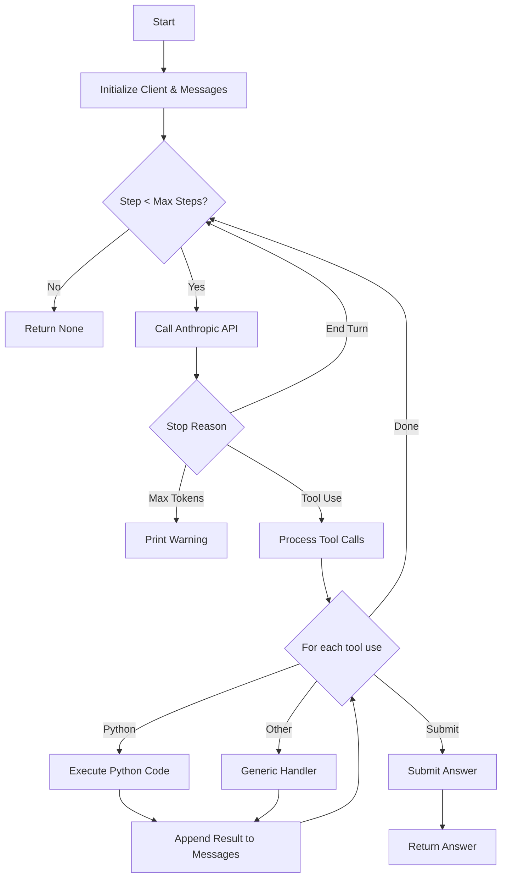

# Code Analysis

## Deep Analysis

The codebase consists of a single Python file `main.py` that implements a basic agent loop using the Anthropic API.

### Core Components

1.  **`run_agent_loop`**: This is the main driver of the agent.
    *   It initializes an `AsyncAnthropic` client.
    *   It maintains a list of `messages` to track the conversation history.
    *   It loops for a maximum of `max_steps` (default 20).
    *   In each step, it sends the current conversation history and available tools to the Anthropic model.
    *   It handles the model's response:
        *   If the model generates text, it prints it.
        *   If the model uses a tool, it executes the corresponding tool handler.
        *   It supports `python_expression` (using `exec`) and `submit_answer`.
    *   It appends the model's response and the tool results back to the `messages` list.
    *   It returns the submitted answer if the `submit_answer` tool is called.

2.  **Tools**:
    *   `python_expression_tool`: Executes Python code using `exec`. It captures `stdout` to return the result. This is a powerful but potentially unsafe tool.
    *   `submit_answer_tool`: Used by the agent to return the final answer.

3.  **Test Execution**:
    *   `run_single_test`: Runs a single instance of the agent loop with a specific prompt and expected answer. It checks if the result matches the expectation.
    *   `main`: Orchestrates the execution of multiple test runs (default 10). It supports both concurrent (using `asyncio.as_completed`) and sequential execution. It calculates and prints the pass rate.

### Observations

*   **Concurrency**: The use of `asyncio` allows for efficient execution of multiple test runs, which is good for evaluating the agent's performance/stability.
*   **Error Handling**: There is basic error handling in the `python_expression_tool` (catching exceptions and returning them as errors). The `run_agent_loop` asserts that the stop reason is valid.
*   **Configuration**: Constants like `MAX_TOKENS`, `model`, and the test prompt/answer are hardcoded.

## ASCII Diagram: Agent Loop

## Questions for User

1.  **Security**: The `python_expression` tool uses `exec` with a limited namespace, but it still allows arbitrary code execution. Is this intended for a controlled environment, or should we consider sandboxing?
2.  **Configuration**: `MAX_TOKENS` (1000) and `model` (`claude-haiku-4-5`) are hardcoded. Would you like to make these configurable via environment variables or arguments?
3.  **Test Flexibility**: The `main` function runs a specific math problem. Should we refactor this to load test cases from a file or configuration?
4.  **Output**: The `python_expression` tool captures `stdout`. Should it also capture the return value of the expression if it's not printed?
